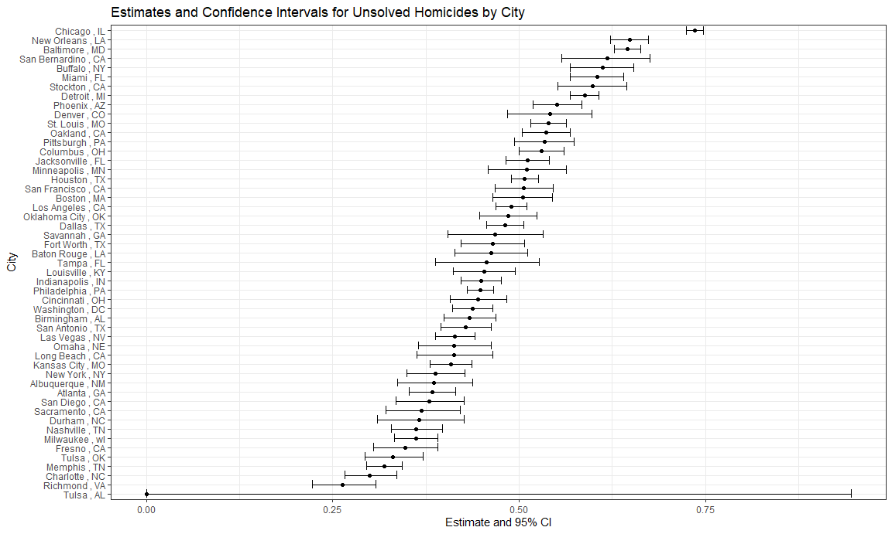
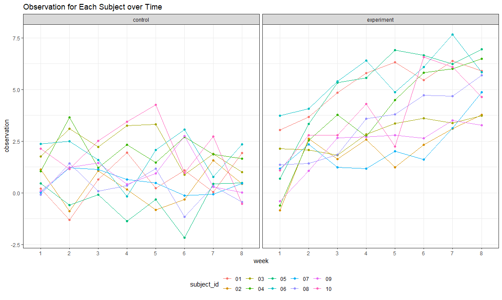

p8105_hw5_zz3167
================
Zhiyi Zhu
2023-11-08

``` r
library(tidyverse)
library(broom)

knitr::opts_chunk$set(
  fig.width = 12,
  fig.asp = .6,
  out.width = "90%",
  message = FALSE, 
  warning = FALSE
)

theme_set(theme_minimal() + theme(legend.position = "bottom"))
```

## Problem 1

### Import data

``` r
homicides_data = 
  read_csv("data/homicide-data.csv") |>
  janitor::clean_names()
```

### Describe the raw data

- The data set contains 52179 observations of 12 variables, which shows
  the details of homicides in 50 large U.S. cities.
- The data set includes the reported date of homicides, the victims’
  personal information, the location and disposition of the homicides.

``` r
# create a city_state variable
homicides_data =
  homicides_data |>
  mutate(city_state = paste(city,',',state))

# summarize within cities to obtain the total number of homicides and the number of unsolved homicides 
homicides_number = 
  homicides_data |>
  group_by(city_state) |>
  summarise(
    total_homicides = n(),
    unsolved_homicides = sum(disposition %in% c("Closed without arrest","Open/No arrest"))
    )

print(homicides_number)
```

    ## # A tibble: 51 × 3
    ##    city_state       total_homicides unsolved_homicides
    ##    <chr>                      <int>              <int>
    ##  1 Albuquerque , NM             378                146
    ##  2 Atlanta , GA                 973                373
    ##  3 Baltimore , MD              2827               1825
    ##  4 Baton Rouge , LA             424                196
    ##  5 Birmingham , AL              800                347
    ##  6 Boston , MA                  614                310
    ##  7 Buffalo , NY                 521                319
    ##  8 Charlotte , NC               687                206
    ##  9 Chicago , IL                5535               4073
    ## 10 Cincinnati , OH              694                309
    ## # ℹ 41 more rows

### Estimate the proportion of homicides

``` r
# estimate the proportion of homicides of Baltimore,MD
baltimore_df = 
  homicides_number |>
  filter(city_state == "Baltimore , MD")

baltimore_result  =
  prop.test(x = pull(baltimore_df, unsolved_homicides), 
            n = pull(baltimore_df, total_homicides),
            alternative = "two.sided",
            conf.level = 0.95, 
            correct = TRUE)|>
  broom::tidy()

baltimore_result
```

    ## # A tibble: 1 × 8
    ##   estimate statistic  p.value parameter conf.low conf.high method    alternative
    ##      <dbl>     <dbl>    <dbl>     <int>    <dbl>     <dbl> <chr>     <chr>      
    ## 1    0.646      239. 6.46e-54         1    0.628     0.663 1-sample… two.sided

``` r
# save the output of prop.test as an R object
save(baltimore_result, file = "result/baltimore_result.RData")

# pull the estimated proportion and confidence intervals from the resulting tidy dataframe
baltimore_tidy = 
data.frame(
  city = 'Baltimore, MD',
  estimate = pull(baltimore_result, estimate),
  ci_lower = pull(baltimore_result, conf.low),
  ci_upper = pull(baltimore_result, conf.high)
) 

print(baltimore_tidy)
```

    ##            city  estimate  ci_lower  ci_upper
    ## p Baltimore, MD 0.6455607 0.6275625 0.6631599

So, the estimated proportion is 0.646. The 95% confidence interval is (
0.628 , 0.663 )

### Run prop.test for each of the cities

``` r
unsolved_propotion = function(city_name) {
  city_number = 
    homicides_number |>
    filter(city_state == city_name)
  
  city_result = 
    prop.test(x = pull(city_number, unsolved_homicides), 
              n = pull(city_number, total_homicides)) |>
    broom::tidy() |>
    select(estimate, conf.low, conf.high)
  
  city_result
}

city_name = pull(homicides_number, city_state)

total_result = 
  data_frame(city_name) |>
  mutate(test_result = map(city_name, unsolved_propotion)) |>
  unnest(test_result)
  
total_result
```

    ## # A tibble: 51 × 4
    ##    city_name        estimate conf.low conf.high
    ##    <chr>               <dbl>    <dbl>     <dbl>
    ##  1 Albuquerque , NM    0.386    0.337     0.438
    ##  2 Atlanta , GA        0.383    0.353     0.415
    ##  3 Baltimore , MD      0.646    0.628     0.663
    ##  4 Baton Rouge , LA    0.462    0.414     0.511
    ##  5 Birmingham , AL     0.434    0.399     0.469
    ##  6 Boston , MA         0.505    0.465     0.545
    ##  7 Buffalo , NY        0.612    0.569     0.654
    ##  8 Charlotte , NC      0.300    0.266     0.336
    ##  9 Chicago , IL        0.736    0.724     0.747
    ## 10 Cincinnati , OH     0.445    0.408     0.483
    ## # ℹ 41 more rows

### Create a plot that shows the estimates and CIs for each city

``` r
total_result |>
  arrange(estimate) |>
  ggplot(aes(x = city_name, y = estimate)) +
  geom_point() +
  geom_errorbar(aes(ymin = conf.low, ymax = conf.high)) +
  theme(axis.text.x = element_text(angle = 45, size = 6))+
  labs(x = "City", 
       y = "Estimate and 95% CI", 
       title = "Estimates and Confidence Intervals for Unsolved Homicides by City")
```



## Problem 2

Create a tidy dataframe containing data from all participants, including
the subject ID, arm, and observations over time:

- Start with a dataframe containing all file names; the list.files
  function will help
- Iterate over file names and read in data for each subject using
  purrr::map and saving the result as a new variable in the dataframe
- Tidy the result; manipulate file names to include control arm and
  subject ID, make sure weekly observations are “tidy”, and do any other
  tidying that’s necessary

``` r
# File names
file_name = 
  list.files(path = "data/longitudinal/")

# Iterate over file names and read in data
longitudinal_df = 
  data_frame(file_name) |>
  mutate(
    file_path = str_c("data/longitudinal/", file_name),
    data = map(file_path, read_csv)) |>
  unnest(data) 

# Tidy the result
longitudinal_df = 
  longitudinal_df|>
  janitor::clean_names() |>
  separate(file_name, into = c("arm", "subject_id"), sep = "_") |>
  mutate(
    arm = case_match(
      arm, 
      "con" ~ "control", 
      "exp" ~ "experiment")) |>
  mutate(subject_id = str_replace(subject_id, ".csv", "")) |>
  pivot_longer(week_1:week_8, 
               names_to = "week",
               names_prefix = "week_",
               values_to = "observation") |>
  select(arm, subject_id, week, observation)

longitudinal_df
```

    ## # A tibble: 160 × 4
    ##    arm     subject_id week  observation
    ##    <chr>   <chr>      <chr>       <dbl>
    ##  1 control 01         1            0.2 
    ##  2 control 01         2           -1.31
    ##  3 control 01         3            0.66
    ##  4 control 01         4            1.96
    ##  5 control 01         5            0.23
    ##  6 control 01         6            1.09
    ##  7 control 01         7            0.05
    ##  8 control 01         8            1.94
    ##  9 control 02         1            1.13
    ## 10 control 02         2           -0.88
    ## # ℹ 150 more rows

### Make a spaghetti plot showing observations on each subject over time, and comment on differences between groups

``` r
longitudinal_df |>
  ggplot(aes(x = week, y = observation, group = subject_id, color = subject_id)) +
  geom_line() +
  facet_grid(.~arm) +
  labs(x = "week",
       y = "observation",
       title = "Observation for Each Subject over Time")
```



- Comment:

## Problem 3

First set the following design elements: \* Fix n=30 \* Fix σ=5

Set μ=0. Generate 5000 datasets from the model: x∼Normal\[μ,σ\]

For each dataset, save μ^ and the p-value arising from a test of H:μ=0
using α=0.05.

### For mu = 0

``` r
sim_test = function(mu){
  
  sim_data = rnorm(n = 30, mean = mu, sd = 5)
  
  sim_result = 
    t.test(sim_data) |>
    broom::tidy()|>
    select(estimate, p.value)
  
  return(sim_result)
}

mu_0_result = 
  expand_grid(
    mu = 0,
    iter = 1:5000
  ) |>
  mutate(result = map(mu, sim_test)) |>
  unnest(result)

mu_0_result
```

    ## # A tibble: 5,000 × 4
    ##       mu  iter estimate p.value
    ##    <dbl> <int>    <dbl>   <dbl>
    ##  1     0     1   -0.465   0.639
    ##  2     0     2    1.19    0.272
    ##  3     0     3    0.225   0.814
    ##  4     0     4    0.700   0.515
    ##  5     0     5    0.993   0.310
    ##  6     0     6    1.27    0.274
    ##  7     0     7   -0.560   0.499
    ##  8     0     8    0.383   0.628
    ##  9     0     9    0.215   0.801
    ## 10     0    10   -0.780   0.438
    ## # ℹ 4,990 more rows
